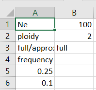

```{r setup, include=FALSE}
knitr::opts_chunk$set(echo = TRUE)
```

# Preliminaries
This document demonstrates how to use the `CNVSelectR` package to take input files and run the method on them. First, we load the package:
```{r}
library(CNVSelectR)
```


# Requirements
Two input files are required:

  * csv file containing two columns, as shown below:
  
  
  
  * txt file containing aligned sequences in FASTA format

It is assumed that these files are in your current working directory.

# Running the method
Now, to generate the null model and obtain confidence intervals and p-values for each duplicate pair, we run:

```{r}
test_out <- CNVSelect_test("cnv_sample_file_1.csv", "cnv_sample_file_2.txt")
```

The raw output from this function looks as follows:
```{r}
test_out
```

# Creating summary output
We can create a summary table and plot as follows:

```{r}
CNVSelect_summary(test_out)
CNVSelect_plot(test_out)
```

